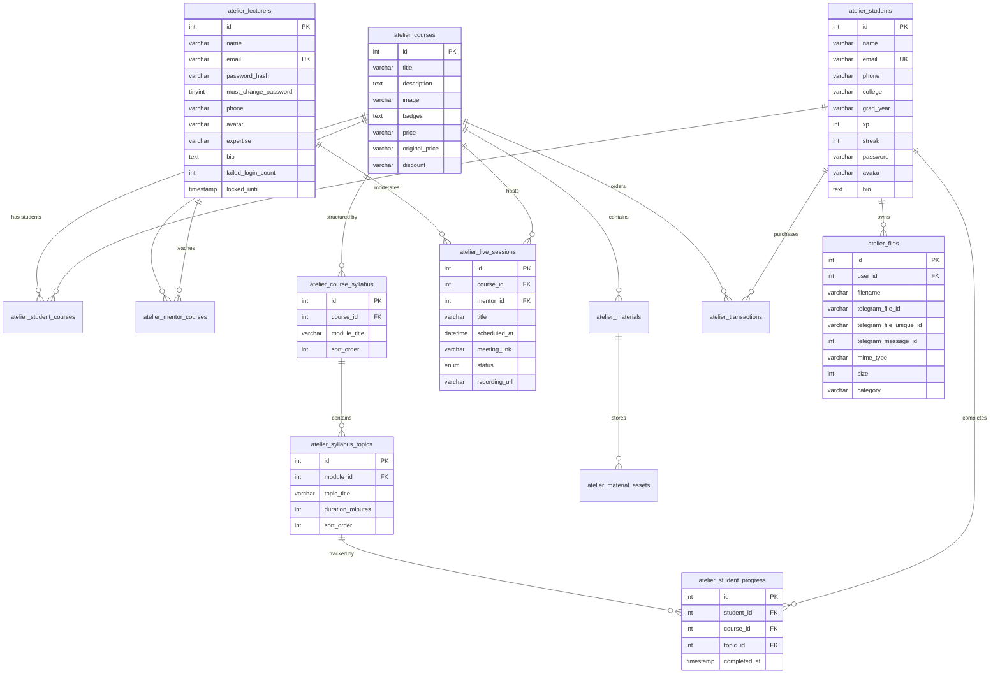

# 🐝 Atelier - Sphere Hive Academy Platform

> **High-Performance Engineering Cohorts, Live Mentorship, and Student Learning Ecosystem.**

Atelier is an enterprise-grade learning workbench and cohort management platform built with **Next.js 16 (Turbopack)**, **React 19**, and a resilient **MySQL** relational database. It features dedicated portals for students, mentors, and administrators, real mathematical curriculum progress calculation, a native embedded **WebRTC Live Classroom (Jitsi Meet)** with mentor host controls, and private backend file storage powered entirely by the **Telegram Bot API** (100% replacing third-party services like Cloudinary).

---

## ⚡ Core Tech Stack

- **Framework**: [Next.js 16.2.9](https://nextjs.org/) (App Router & Turbopack)
- **UI Engine**: [React 19.2.4](https://react.dev/)
- **Database**: MySQL 8.0+ via [`mysql2/promise`](https://github.com/sidorares/node-mysql2) connection pooling with idempotent migrations
- **Real-Time Analytics & Audit**: [Tinybird](https://www.tinybird.co/) (Serverless ClickHouse) for high-throughput event streaming, non-blocking telemetry, and immutable admin audit trails (zero MySQL bloat)
- **File Storage**: Private Telegram Bot API storage backend with zero client-exposed secrets
- **Live Classroom**: Embedded Jitsi Meet WebRTC API with two-way audio, real-time in-room chat space, mentor screen sharing, and host moderation tools
- **Payment Gateway**: [Razorpay Node SDK](https://razorpay.com/) (order creation & HMAC SHA-256 signature verification)
- **ATS Resume Analyzer**: Dedicated Python FastAPI microservice with self-hosted open-source `BAAI/bge-small-en-v1.5` embeddings, PyMuPDF, python-docx, and multi-tier keyword taxonomy
- **Animations & Smooth Scroll**: [GSAP](https://greensock.com/gsap/) & [Lenis](https://lenis.darkroom.engineering/)
- **Authentication & Security**: Salted `scryptSync` cryptographic password hashing, timing-safe equality checks, JWT session tokens, and 15-minute brute-force lockout protection


---

## 🏛️ System Architecture

```mermaid
graph TD
    subgraph ClientLayer["Frontend Portals (React 19 / Next.js)"]
        PublicApp["Public Marketing & Catalog (/courses)"]
        ResumeCheckerUI["ATS Resume Checker (/resume-checker)"]
        StudentDash["Student Workspace (/dashboard)"]
        MentorPortal["Mentor Portal (/mentor)"]
        AdminConsole["Admin Control Node (/admin & /admin/analytics)"]
        ClientEventQueue["Client Event Queue (Batches 25-100 / Flush 5s)"]
    end

    subgraph ServiceLayer["Next.js Server Actions & API Routes"]
        AuthService["Auth & Security (scrypt / JWT / Lockout)"]
        LiveService["Live Class Coordinator (Signaling)"]
        SyllabusEngine["Mathematical Progress Engine"]
        TelegramStorage["Telegram Bot Storage Bridge"]
        RazorpayService["Payment Verification Node"]
        ATSApiProxy["ATS Secure Proxy (/api/ats/analyze)"]
        AnalyticsProxy["Analytics SDK & Proxy (/api/analytics)"]
    end

    subgraph DedicatedServices["Dedicated Standalone Microservices"]
        ATSService["Python FastAPI ATS Microservice\n• PyMuPDF / docx Parser\n• BGE-small-en-v1.5 Embeddings\n• Multi-Tier Keyword Matcher\n• Explainable Scoring Engine"]
    end

    subgraph ExternalServices["External Infrastructure"]
        JitsiMeet["Jitsi Meet WebRTC (Embedded Audio/Video/Screen Share)"]
        TelegramCloud["Telegram Bot API (File Chunks & Blobs)"]
        RazorpayAPI["Razorpay Payment Gateway"]
        TinybirdCloud["Tinybird Cloud (Managed ClickHouse Analytics & Audit)"]
    end

    subgraph DatabaseLayer["MySQL Relational DB (localhost:3306)"]
        MySQL[(Atelier Relational Database)]
    end

    ResumeCheckerUI -- "Multipart Upload" --> ATSApiProxy
    ATSApiProxy -- "HTTP (x-api-key)" --> ATSService
    StudentDash -- "Polled every 25s" --> LiveService
    LiveService -- "Mounts WebRTC Room" --> JitsiMeet
    MentorPortal -- "Host Controls & Screen Share" --> JitsiMeet
    MentorPortal -- "CRUD Syllabus & Cascade Topics" --> SyllabusEngine
    SyllabusEngine -- "Calculates % (Completed / Total)" --> MySQL
    AdminConsole & MentorPortal -- "Uploads Assets / Avatars" --> TelegramStorage
    TelegramStorage -- "Multipart Stream" --> TelegramCloud
    StudentDash -- "Enrolls & Pays" --> RazorpayService
    RazorpayService -- "Verifies Signature" --> RazorpayAPI
    ClientLayer -- "Tracks User Actions" --> ClientEventQueue
    ClientEventQueue -- "Batched Ingestion" --> AnalyticsProxy
    ServiceLayer -- "Authoritative Events (Non-blocking)" --> AnalyticsProxy
    AnalyticsProxy -- "NDJSON Stream (Bearer Token)" --> TinybirdCloud
    AdminConsole -- "Query Aggregations (Cached 60s)" --> AnalyticsProxy
    ServiceLayer <--> MySQL
```




---

## 🗃️ Database Schema & Normalization (ERD)

All tables use the `atelier_` namespace with cascading foreign keys to preserve strict data integrity:



---

## 🌟 Key Platform Capabilities

### 1. 🎓 Student Learning Workspace (`/dashboard`)
- **Mathematical Progress Engine**: Progress is calculated as:
  $$\text{Progress \%} = \text{round}\left(\frac{\text{completed\_topics}}{\text{total\_topics}} \times 100\right)$$
  Derived from normalized syllabus tables. Completing 100% of curriculum topics automatically timestamps `atelier_student_courses.completed_at`.
- **Initials Avatar Badge**: Zero reliance on default stock images. Users without an uploaded avatar render a deterministic initials badge (`<InitialsAvatar />`) styled according to their unique name hash.
- **Resilient Real-Time Live Classroom (`/dashboard/live`)**:
  - **Dual-Mode Attendance**: Attend inside the high-fidelity embedded in-app classroom (`<LiveClassroom />`) or launch natively via **"Open in Separate Tab ↗"**.
  - **Intelligent Meeting Link Resolver**: Automatically recognizes external conferencing services (Google Meet, Zoom, MS Teams, YouTube) and renders an instant launch interface instead of forcing broken iframes.
  - **Auto-Healing Room Links**: Missing, empty, or raw room names automatically normalize into secure, encrypted WebRTC conference URLs.
  - **Automatic Live Polling**: State synchronizes every 25 seconds, reflecting mentor broadcasts in real time without requiring manual refreshes.
  - **Replay Library**: Access recorded lecture replays directly with one-click streaming.
- **Resource Materials**: Direct streaming downloads of course PDF slides, cheatsheets, and starter repositories.

### 2. 👨‍🏫 Mentor Portal & Workspace (`/mentor`)
- **Enterprise Security**: Salted `scryptSync` password hashing with timing-attack mitigation, 5-attempt/15-minute brute-force lockout, and mandatory password reset on initial sign-in.
- **Intelligent Ownership Resolution & Auto-Healing**: Mentors are strictly authorized to view only their assigned cohorts (`assertMentorOwnsCourse`), with automatic permission healing across `atelier_mentor_courses` and `atelier_courses.instructor_id`.
- **Route Redirection & Hydration Guards**: Next.js route redirection from `/mentor/course/:id` to `/mentor/courses/:id` with client hydration protection to eliminate premature "Access Denied" flashes.
- **4-Tab Cohort Studio (`/mentor/courses/[id]`)**:
  1. **Enrolled Students**: Student directory with contact details and real-time curriculum progress bars.
  2. **Live Classes**: Schedule sessions with MySQL datetime normalization (`YYYY-MM-DD HH:mm:ss`), start live broadcasts with concurrency prevention (maximum 1 active live class per mentor), enter the **Broadcast Studio**, and conclude classes with recorded replay URLs.
  3. **Syllabus Manager**: Add, edit, and delete modules and curriculum topics (deleting a topic automatically cascades and recalculates student percentages).
  4. **Course Materials**: Create resource folders and upload files directly.
- **Host / Moderator Controls**:
  - **Mute All Participants (`mute-everyone`)**: Instantly silence attendee microphones.
  - **Kick Disruptive Students**: Eject any attendee from the classroom.
  - **Screen Sharing**: Broadcast code editors and browser windows in HD.
  - **In-Room Chat**: Real-time discussions during live sessions.
  - **Open in Tab / Direct Breakout**: Host can pop into a full browser window at any time.

### 3. 🛡️ Admin Console (`/admin`)
- **Hardened Server-Side Security**: Clearance authentication is evaluated entirely server-side via `verifyAdminClearance` and `validateAdminSession` Server Actions against protected environment variables, completely removing sensitive keys from client JavaScript bundles.
- **HMAC-SHA256 Signed Session Tokens**: Issues cryptographically signed admin tokens valid for 12 hours, verified on initial mount and route transitions.
- **Modern Responsive Dialog Modals**:
  - Pinned modal header and footer ("Commit Changes" / "Cancel") with an independently scrollable form body (`max-height: 88vh` / mobile `92vh`).
  - Modal action buttons are permanently accessible and never clipped off screen, even with 15+ input fields.
  - Responsive multi-column grids that gracefully collapse into clean single-column inputs on mobile devices (`<= 768px`).
  - Horizontally scrollable navigation tabs and wide data tables (Payments, Students, Courses) with sleek touch scrolling.
- **Mentor Provisioning & Automatic Course Sync**: Register mentors, assign cohorts (automatically syncing `atelier_mentor_courses`), and generate temporary credentials with mandatory first-login password reset.
- **Complete CRUD Management**: Students, courses, live timetables, material assets, hotline callback requests, and Razorpay transaction logs.

### 4. 📝 Enterprise Assessment & Evaluation Engine
- **Course-Scoped Architecture**: All assessments natively belong to courses (`atelier_courses`), preserving cohort ownership and strict enrollment authorization.
- **Support for 14 Question Types**:
  1. **Single-Choice MCQ**: Automatic key matching and negative scoring.
  2. **Multiple-Choice (Multi-Select)**: Configurable partial credit and negative marking.
  3. **True / False**: Single-click Boolean verification.
  4. **Fill in the Blank**: Exact and whitespace/case-normalized text evaluation.
  5. **Numerical**: Floating-point value checking with configurable absolute error tolerance.
  6. **Matching Pairs**: Interactive multi-item correspondence matching.
  7. **Chronological Ordering**: Interactive up/down sequence sorting.
  8. **Short Answer**: Concise subjective input with instructor evaluation.
  9. **Essay / Analysis**: In-depth essay editor with detailed grading rubrics.
  10. **Interactive Coding**: Embedded Monaco Editor with JavaScript/Python sandboxed runner and test cases.
  11. **Code Debugging**: Broken starter code with live in-browser test validation.
  12. **SQL Sandbox**: Ephemeral in-memory SQLite execution (`node:sqlite`) isolated from production MySQL.
  13. **Predict Code Output**: Accurate console prediction with multi-line matching.
  14. **Technical File Upload**: Diagram and artifact submission backed by Telegram Bot API private storage.
- **Section Grouping & Reusable Question Bank**: Group questions logically into sections and link reusable questions from the course question bank.
- **Server-Authoritative Countdown Timer & Autosave**: Server-synchronized timer prevents client tampering and auto-submits on expiration; debounced autosave continuously persists drafts.
- **Proctoring Audit Log**: Monitors and records tab switches, window blur events, and full-screen escapes with student warning modals and instructor flags.
- **Manual Grading & Rubric Scoring**: Mentors review student essay and file submissions, award criteria marks, and provide constructive feedback.
- **Admin Analytics & CSV Export**: Universal assessment management across all cohorts with one-click results CSV export.

### 5. 📦 Zero-Cloudinary File Storage (Telegram Bot API)
- Uploaded avatars and course materials are streamed to a private Telegram channel via the Telegram Bot API (`TELEGRAM_BOT_TOKEN`, `TELEGRAM_STORAGE_CHAT_ID`).
- Supports files up to **50 MB**.
- All secrets remain on the server; the client interacts solely with sanitized Next.js proxy endpoints (`/api/files/[id]`, `/api/files/upload`).

### 6. 🎯 Dedicated ATS Resume Analyzer (`/resume-checker`)
- **100% Free & Open-Source**: Publicly accessible from the site footer and student dashboard.
- **Local BGE Model (`BAAI/bge-small-en-v1.5`)**: Self-hosted local vector embeddings loaded once in memory via singleton manager; zero external paid AI API calls (no OpenAI, Gemini, Claude, Groq).
- **Multi-Format Parsing**:
  - PDF: PyMuPDF (`pymupdf`) layout, column, font, and table extraction.
  - DOCX: `python-docx` paragraph, table, and header/footer inspection.
- **Explainable Scoring Engine**: Computes the *Atelier Resume Compatibility Score* across Keyword Match (35 pts), Semantic Relevance (25 pts), Required Skills (20 pts), Resume Structure (10 pts), Formatting (5 pts), and Contact Info (5 pts).
- **Deterministic Actionable Guidance**: Clear advice on bullet point metrics, layout corrections, and missing stack technologies without AI hallucinations.
- **Isolated Python FastAPI Microservice**: Operates in `/ats-service` to ensure zero load or latency degradation on the Next.js server.

### 7. 📊 Production Analytics & Audit Logging Engine (Tinybird & ClickHouse)
- **Zero MySQL Analytics Bloat**: All analytics telemetry and administrative audit trails are decoupled from MySQL and streamed into **Tinybird (ClickHouse)**. Primary application tables remain exclusively focused on transactional data.
- **Fail-Safe & Non-Blocking**: Analytics dispatch uses non-blocking asynchronous execution with strict 4-second timeouts. If Tinybird is unreachable or in deployment, user requests, checkouts, and student operations proceed with zero latency penalty or failure.
- **Central Analytics SDK (`@/lib/analytics`)**:
  - `track(eventName, payload)`: Client-side event tracking.
  - `trackServer(eventName, payload)`: Authoritative server-side event tracking.
  - `trackAudit(auditPayload)`: Cryptographically isolated administrative mutation audit logging.
- **Client Event Queue & Batching (`queue.ts`)**:
  - In-memory event buffer automatically batches 25–100 events.
  - Periodic flushes every 5 seconds.
  - Automatically flushes on tab close or page visibility change using `navigator.sendBeacon` and `keepalive: true`.
  - Exponential backoff retry logic for transient failures; bounds queue size (max 1000 events) to protect browser memory.
- **Privacy by Default**: Central `sanitizeMetadata()` sanitization systematically scrubs passwords, JWT tokens, Bearer authorization headers, Razorpay secrets, and API keys before transmission.
- **Dedicated Admin Analytics Console (`/admin/analytics`)**:
  - Native integration with the existing `/admin` design language, dark aesthetic, and `AdminSecurityGuard` authorization.
  - **Overview**: Real-time DAU, WAU, MAU, New Users, Active Sessions, Enrollments, Completions, Assessment Attempts, Avg Score, Verified Payments, and Gross Revenue.
  - **User Analytics**: Total users, Students/Mentors/Admins breakdown, and interactive 14-day daily active user & session SVG timeseries charts.
  - **Learning Analytics**: Course views, enrollments, completions, drop-off milestones (25%, 50%, 75%), topic completions, and course-by-course progress tables.
  - **Assessment Analytics**: Total attempts, avg scores, pass/fail rates, avg completion time, auto-submissions, and question-level difficulty analysis.
  - **Live Classroom**: Session counts, attendance volume, unique attendees, avg class duration, peak concurrent viewers, and replay views.
  - **Payment & Funnel**: Checkout-to-enrollment conversion funnel (`Course View` → `Checkout` → `Payment` → `Enrollment`), failed payments, and revenue volume.
  - **System & Health**: API requests, error rates, slow request warnings (>1000ms), slowest endpoints breakdown, and recent incident logs.
  - **Forensic Audit Trail**: Real-time table of sensitive administrative actions (Admin Email, Action, Entity, Entity ID, Old Value, New Value, Status) with full search filtering.
  - **Performance Caching**: 60-second in-memory query cache with manual **Refresh** control and "Last updated" timestamps.

---

## 🚀 Environment Configuration

Create a `.env.local` file in the root directory:

```env
# ── 1. Application & Domain URLs ──
NEXT_PUBLIC_APP_URL=http://localhost:3000
NEXT_PUBLIC_SITE_URL=https://atelier.spherehive.com

# ── 2. MySQL Database Connection ──
DB_HOST=localhost
DB_PORT=3306
DB_USER=root
DB_PASSWORD=your_mysql_password
DB_NAME=atelier

# ── 3. Telegram Bot API Storage (Server-side only) ──
TELEGRAM_BOT_TOKEN=your_bot_token_here
TELEGRAM_STORAGE_CHAT_ID=your_channel_chat_id_here

# ── 4. Session & Mentor JWT Security ──
SESSION_SECRET=a_strong_random_32_character_secret_here

# ── 5. Admin Console Server Security Keys (Protected server-side) ──
MASTER_SECURITY_KEY=ARSHAD-SAMVRUDHI
CLEARANCE_PASSWORD=noor

# Legacy / Client fallback keys (Optional)
NEXT_PUBLIC_MASTER_SECURITY_KEY=ARSHAD-SAMVRUDHI
NEXT_PUBLIC_CLEARANCE_PASSWORD=noor

# ── 6. Razorpay Payment Gateway (Optional) ──
RAZORPAY_KEY_ID=
RAZORPAY_KEY_SECRET=

# ── 7. Social OAuth Sign-In (Optional) ──
GOOGLE_CLIENT_ID=
GOOGLE_CLIENT_SECRET=
GITHUB_CLIENT_ID=
GITHUB_CLIENT_SECRET=

# ── 8. Dedicated ATS Resume Microservice (Python FastAPI) ──
ATS_SERVICE_URL=http://127.0.0.1:8000
ATS_API_KEY=atelier-ats-production-key-2026

# ── 9. Tinybird ClickHouse Analytics & Audit System ──
TINYBIRD_API_URL=https://api.europe-west2.gcp.tinybird.co
TINYBIRD_API_KEY=your_tinybird_token_here
TINYBIRD_DATA_SOURCE=atelier_events
TINYBIRD_AUDIT_DATA_SOURCE=atelier_audit_events
```


---

## 🌐 Production Hosting Architecture: Is Vercel Hosting Fine?

### Quick Answer:
- **Next.js Frontend & Core API**: **YES**, Vercel hosting is **100% fine and recommended** for the Next.js application.
- **ATS Resume Analyzer Service**: **NO**, the ATS Python service **CANNOT run on Vercel alone** and requires a container or VPS host.

### Detailed Technical Breakdown:

| Layer | Recommended Host | Why? |
| :--- | :--- | :--- |
| **Atelier Web App (Next.js 16)** | **Vercel** / AWS Amplify | Perfect for React 19 SSR, Edge routes, assets, and standard API proxying. |
| **ATS Python Microservice** | **Render / Railway / Fly.io / VPS (DigitalOcean / Hetzner / AWS EC2)** | The BGE embedding model + PyTorch + PyMuPDF runtime is **~800MB–1.2GB**, far exceeding Vercel's 50MB–250MB serverless bundle limit. It also requires persistent RAM to keep the BGE model loaded for 100ms instant inferences. |

### How It Works Together in Production:
1. **Deploy Next.js on Vercel**: Connect your GitHub repository to Vercel.
2. **Deploy ATS Microservice on Render / Railway / Fly.io / Docker VPS**:
   - In your cloud dashboard, point to the `/ats-service` directory.
   - Use the provided `Dockerfile` and `docker-compose.yml`.
   - The service will download `BAAI/bge-small-en-v1.5` once and persist weights to a volume.
   - Example live URL: `https://atelier-ats.onrender.com`
3. **Configure Environment Variables in Vercel**:
   ```env
   ATS_SERVICE_URL=https://atelier-ats.onrender.com
   ATS_API_KEY=your_secure_ats_key
   ```
4. **Result**: Your users visit `https://atelier.spherehive.com/resume-checker` on Vercel. When they upload a resume, Vercel securely proxies the request to your dedicated ATS service, keeping the main platform blazing fast.

---

## 🛠️ Getting Started

### 1. Install Node Dependencies
```bash
npm install
```

### 2. Setup & Start Dedicated ATS Python Microservice
```bash
# Navigate to ats-service directory
cd ats-service

# Create virtual environment
python -m venv venv

# Windows
.\venv\Scripts\activate
# Linux/macOS
# source venv/bin/activate

# Install dependencies
pip install -r requirements.txt

# Run pytest test suite (19 tests)
pytest tests

# Launch FastAPI ATS server on port 8000
uvicorn app.main:app --host 0.0.0.0 --port 8000
```

### 3. Launch Next.js Development Server
```bash
npm run dev
```
*Note: All MySQL database tables, composite indexes, and normalized syllabus seeds are initialized automatically upon launch.*

### 4. Production Build & Verification
```bash
npm run build
npm run start
```

### 5. Analytics & Audit Engine Verification
```bash
# Run comprehensive verification suite (34 automated checks verifying SDK, queues, pipes, sanitization, and fallback)
node scripts/test-analytics.mjs
```

---

## 🧪 Testing Credentials

| Portal | Route | Default Credentials |
| :--- | :--- | :--- |
| **Admin Console** | `/admin` | Security Key: `ARSHAD-SAMVRUDHI`<br>Password: `noor` |
| **Admin Analytics Engine** | `/admin/analytics` | Security Key: `ARSHAD-SAMVRUDHI`<br>Password: `noor` (or seamless SSO from `/admin`) |
| **Mentor Portal** | `/mentor/login` | Email: `mentor@atelier.io` (or any email registered by Admin)<br>Password: `mentor123` (Prompts password reset upon initial login) |
| **Student Workspace** | `/auth/signin` | Email: `jane.doe@atelier.com`<br>Password: `password` |
| **ATS Resume Checker** | `/resume-checker` | **Free Public Access** (No login required) |

---

## 🧭 Public Route & SEO Sitemap

- `/` - Landing page with SEO metadata and educational organization JSON-LD schema
- `/resume-checker` - Public ATS Resume Analyzer with local BGE embedding scoring & format audit
- `/courses` - Cohort tracks catalog with category filters and search
- `/courses/[id]` - Dynamic course details page with Course JSON-LD schema and OpenGraph previews
- `/contact` - Admissions counseling and callback request form
- `/privacy-policy` - Data handling, transaction terms, and privacy disclosures
- `/refund-policy` - Pricing, cancellation, and refund policies
- `/terms` - Code of conduct and enrollment terms of service
- `/sitemap.xml` - Dynamic sitemap with priority ratings for search engines
- `/robots.txt` - SEO robots configuration allowing public indexation while securing private dashboards

---

## 📄 License

Proprietary and confidential. Developed for **Atelier - Sphere Hive Academy**. All rights reserved.
